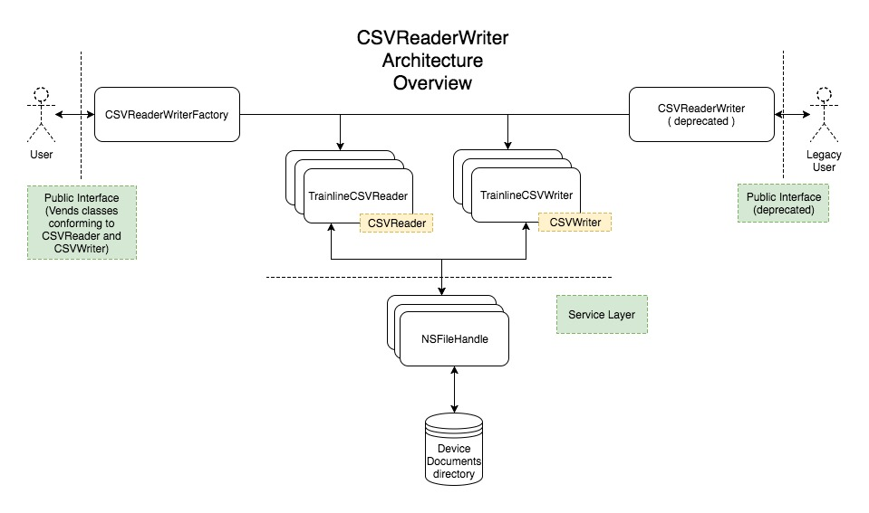

# CSVReaderWriter

__NB__ This document is written in Markdown using github's specification (https://github.github.com/gfm/). For best reading experience, please use a Markdown renderer to view this file.

## Defining CSV

As per RFC4180 - Section 2 (https://tools.ietf.org/html/rfc4180), there is no formal CSV specification in existence. This document will form the basis of an internal specification based on a subset of the rules suggested in RFC4180.

__NB: The specification below is perhaps more limited than a production ready specification.__

- An optional, single row header may be present. The header will specify the field name for each column present in the file. If the header is not present, generic field names will be generated eg "0", "1", "2" etc.
- Each data record in the proceeding rows should have each element separated by one of the supported separator character types.
- Each data record row should be delimited by one of the supported newline character types.
- Field names and data record elements must not contain newline characters or separator characters - even if escaped with a '\' character.
- Blank record elements may be represented by 0 characters or by some number of whitespace characters, delimited appropriately as per the specifications above.
- The final row in the file may optionally omit a trailing newline character.
- Double quotes will be treated as part of the field name or record data, and will not affect the other rules defined in the specification.

## Implementation Requirements
- Allow users to read the contents of a specified CSV file into memory.
- Allow users to write data in memory to a new CSV file.
- Provide informative errors to the user when operations are unsuccessful.
- Allow some configurability and flexibility to support CSV files in a variety of formats.
- Support backwards compatibility for users depending on the existing API interface
- Parsing large files should not impact end user experience.

## Solution Design

#### Tool Selection

After analysing available file I/O tools available in Apple frameworks, NSFileHandle was chosen. Apple recommends using the highest level framework available that meets the need of the program. NSFileHandle meets the needs of reading and writing from a file, and also provides methods for seeking through as file - potentially helpful in future should the need to support resuming partial file reads over multiple sessions arise.

#### Architecture Overview

It was decided to split the reading and writing functionality into separate single-responsibility classes. The public interface of each class is defined by a respective protocol. Concrete instances are vended by a factory class. The factory pattern helps support dependancy injection in this example, but may be unnecessary in a real world program with an existing injection mechanism.

Backwards compatibility is maintained via a facade class with a name and interface matching the original implementation. This facade acts as a controller to manipulate the new reader and writer classes.

## Possible Future Extensions
- Support for escaped characters inside field name and element data.
- Support for escaping characters bound inside double quote pairs.
- Support for multi-character separator and newline strings (eg \r\n).
- Support for parsing large files directly into a persistence store (eg Core Data).
- Support for recognising and converting data types that could be better represented as objects (eg date strings -> NSDate/Date).
- Support for paged access when reading data to accommodate very large CSV files that may otherwise create performance or memory concerns.
- Configuration on how to handle some errors (eg optionally skipping rows that contain incorrect format information).
- Support for blank rows
- Support for multiple encoding types
- Support for appending to existing files when writing

## Improvements

#### Errors

Vending an API with Swift errors can result in a awkward interface for users, sometimes requiring nested try/catch blocks, I think this could be improved.
